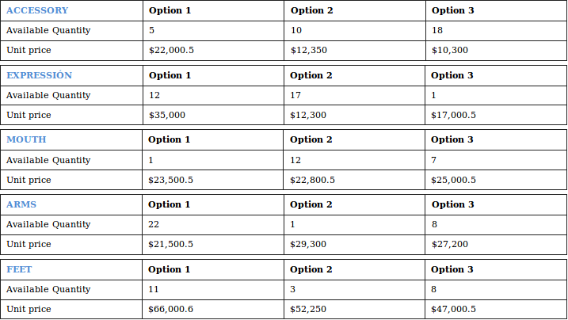
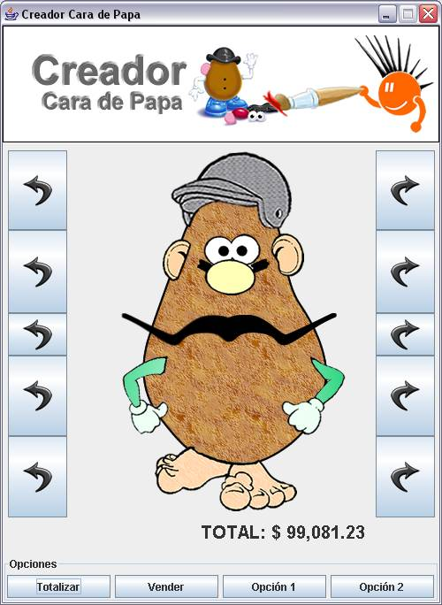

# Enunciado

An online store that allows to design and purchase a Mr. Potato Head wants to be built.
Each customer must be able to design a Mr Potato Head as he likes, calculate the price
if its design and bui it when he has finished choosing all the parts.

It has been established to divide the five types of doll parts and that each of these
three possibilities can be chosen. The parts include eyes + nose + ears (facial
expression), headgear, mouth, arms and feet.

Each part of the design of Mr. Potato Head knows the type of part to which it belongs
and has additionally a base price and a quantity of units available.

Once the customer designs the "Mr. Potato Head" to his liking, he can buy it at the
store. The purchase is possible if the inventory is at least one unit available for
each of the selected parts.

Before he buys it, the customer can calculate the price of "Mr. Potato Head" by
clicking on "Summarize". Once the customer knows the final price of Mr. Potato Head,
then he can buy it through the button "Sell."

To summarize the price of Mr. Potato Head design it is taken into account the
following conditions for each of the parts.

· 10% discount on the base price of the part, if the amount of available units is
greater than 10.

· 15% increase over the base price of the hand, if the number of units available
is less than 10.

· There is no discount if the amount of available units of the part is equal to 10.

Additionally, depending on the total purchase value, after considering the above cases,
it is wanted to pursue an other discount with the following conditions:

· 10% discount on the total value of the design, if the total value is greater
than or equal to $ 50,000 and less than $ 100

· 15% discount on the total value of the design, if the total value is greater
than or equal to $ 100,000 and less than $ 150,000

· 20% discount on the total value of the design, if the total value is greater
than or equal to $ 150,000

The application must be able to modify any of the parts in accordance with the
possibilities by type. It is this way the design of Mr. Potato Head is created by
selecting each part.

Example of quantity by type of part: 

# Interfaz

